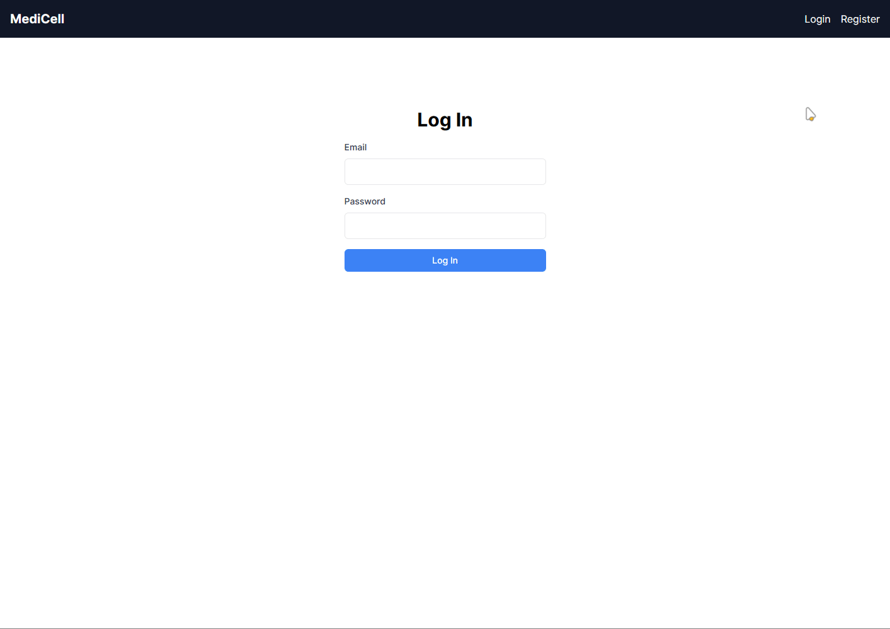
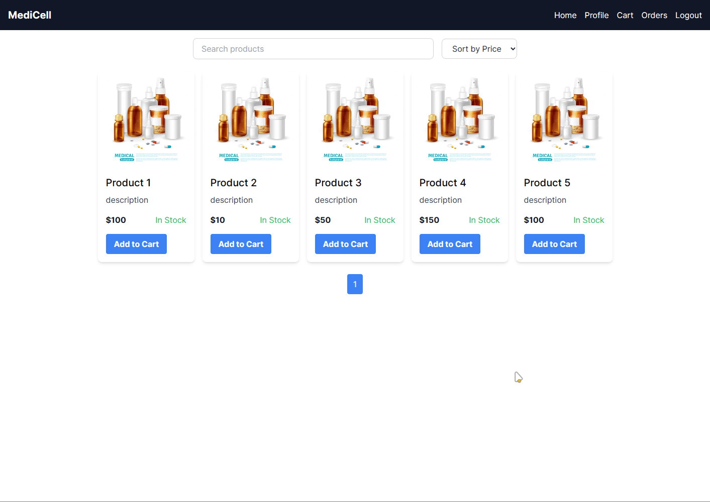
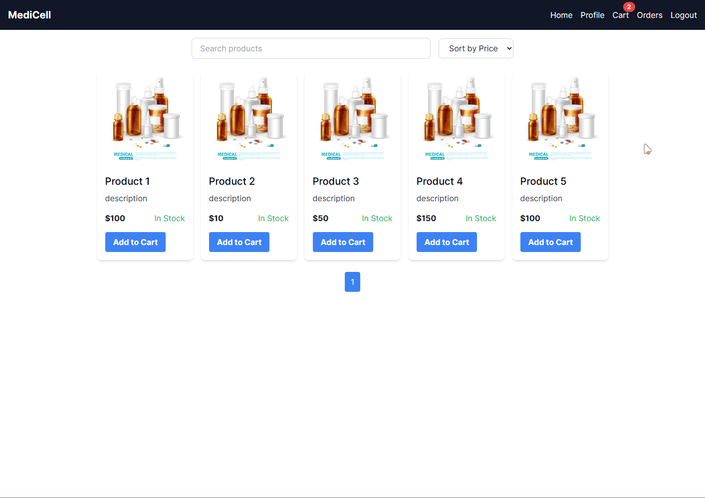

Medisell is an online platform that enables the customers to buy medicines from the comfort of their homes. The platform consists of a web application built using .NET Framework [Backend](https://github.com/b14ck0ps/MediSell) 💻 4.8.1 with Web API and frontend with Nextjs and Tailwind.

### Demo

Login and registration 

Homepage

Cart and checkout

#### 